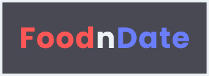

 

<h1 align="center">FoodnDate</h1>
<h4 align="center">KodeGo Web Development Batch 3: Exceeds<br> Group 1 Final Capstone Project</h4> 
<hr>

> The instructions below are for running it into your local machine. You can click [here](#) to view the deployed project.

### Execution Instructions

1. Clone this repository by writing the following command inside your terminal:
```javascript
git clone https://github.com/ryanregis/FoodnDate.git
```

2. Make sure you go into the root folder by typing: 

```javascript
cd FoodnDate-main // or whatever the folder name is
```

3. Run the program by typing:
```javascript
npm run serve
```

4. You can then go into [http://localhost:3000](http://localhost:3000) to run the whole program.
